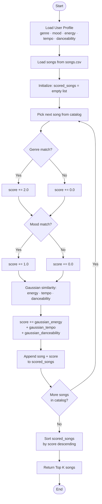

# 🎵 Music Recommender Simulation

## Project Summary

In this project you will build and explain a small music recommender system.

Your goal is to:

- Represent songs and a user "taste profile" as data
- Design a scoring rule that turns that data into recommendations
- Evaluate what your system gets right and wrong
- Reflect on how this mirrors real world AI recommenders

Replace this paragraph with your own summary of what your version does.

---

## How The System Works

Real-world recommenders like Spotify and YouTube build recommendations from two kinds of signals: what you explicitly tell the system (your favorite genre, your current mood) and implicit behavioral signals measured from the music itself (how energetic a track is, how acoustically warm it sounds). They combine these signals using a scoring model, rank every candidate, and surface the top results. This simulation prioritizes **perceptual proximity** — the idea that a good recommendation should feel close to what you already love, not just louder or faster. Rather than treating features as "more is better," each numerical feature is scored with a Gaussian similarity function that peaks when a song matches the user's preferred value and falls off smoothly on both sides. Categorical features like genre and mood act as hard-weighted gates: a genre mismatch costs the most points, reflecting how unlikely a listener is to accept a rock song when they asked for jazz. The result is a transparent, explainable score out of 100 for every song in the catalog, with the top _k_ songs returned as recommendations.



### Song Features

Each `Song` object carries the following attributes:

| Feature        | Type        | What it captures                                                              |
| -------------- | ----------- | ----------------------------------------------------------------------------- |
| `id`           | int         | Unique identifier                                                             |
| `title`        | str         | Song name                                                                     |
| `artist`       | str         | Artist name                                                                   |
| `genre`        | str         | Broad musical category (pop, lofi, rock, jazz, ambient, synthwave, indie pop) |
| `mood`         | str         | Emotional label (happy, chill, intense, moody, relaxed, focused)              |
| `energy`       | float (0–1) | Perceived intensity and power                                                 |
| `tempo_bpm`    | float       | Beats per minute — normalized to 0–1 for scoring                              |
| `valence`      | float (0–1) | Musical positivity — high = bright/upbeat, low = dark/heavy                   |
| `danceability` | float (0–1) | Rhythmic drive and groove                                                     |
| `acousticness` | float (0–1) | Organic vs. electronic production character                                   |

### UserProfile Features

Each `UserProfile` stores the user's taste preferences:

| Field            | Type        | Purpose                                                           |
| ---------------- | ----------- | ----------------------------------------------------------------- |
| `favorite_genre` | str         | Matched against `song.genre` for a categorical score              |
| `favorite_mood`  | str         | Matched against `song.mood` for a categorical score               |
| `target_energy`  | float (0–1) | Preferred energy level — center of the Gaussian curve             |
| `likes_acoustic` | bool        | Whether the user prefers acoustic/organic texture over electronic |

### Scoring Summary

```
total_score (out of 100) =
    30 × genre_match          ← 1 if genre matches, else 0
  + 20 × mood_match           ← 1 if mood matches, else 0
  + 20 × gaussian(energy)     ← peaks at target_energy, tolerance = 0.2
  + 15 × gaussian(valence)    ← peaks at preferred valence
  + 10 × gaussian(tempo)      ← peaks at preferred tempo (normalized)
  +  5 × gaussian(acousticness) ← peaks at preferred acousticness
```

Songs are ranked by `total_score` descending; the top `k` are returned.

---

## Algorithm Recipe

This is the finalized scoring strategy derived from analyzing the full catalog. Apply it in `score_song()`.

### Step 1 — Categorical gates (exact string match)

| Signal | Points | Notes |
|--------|--------|-------|
| Genre match | **+5** | Strongest stable preference; a jazz fan won't enjoy metal even if the mood fits |
| Mood match | **+4** | High-intent situational signal; should outweigh all continuous features combined |

### Step 2 — Gaussian continuous similarity

For each continuous feature, compute `gaussian_sim(user_val, song_val, σ) = exp(-((user_val - song_val)² / (2σ²)))` then multiply by the max points for that feature.

| Feature | Max points | σ | Rationale |
|---------|-----------|---|-----------|
| `energy` | **×3** | 0.20 | Spans full [0.25–0.97] range in catalog; most discriminative continuous axis |
| `valence` | **×2** | 0.20 | Independent emotional tone; not captured by mood alone |
| `danceability` | **×1** | 0.25 | Distinguishes groove-heavy r&b from classical at similar energy levels |

**Max possible score: 5 + 4 + 3 + 2 + 1 = 15 points**

### Step 3 — Features to exclude

| Feature | Reason to skip |
|---------|---------------|
| `acousticness` | Near-perfect inverse of `energy` in this catalog (≈ `1 − energy`); weighting it separately double-counts the same signal |
| `tempo_bpm` | Nearly linear with `energy` across all 18 songs; adds noise rather than information |

### Step 4 — Rank and return

Sort `scored_songs` by total score descending; return the top `k` entries.

---

## Getting Started

### Setup

1. Create a virtual environment (optional but recommended):

   ```bash
   python -m venv .venv
   source .venv/bin/activate      # Mac or Linux
   .venv\Scripts\activate         # Windows

   ```

2. Install dependencies

```bash
pip install -r requirements.txt
```

3. Run the app:

```bash
python -m src.main
```

### Running Tests

Run the starter tests with:

```bash
pytest
```

You can add more tests in `tests/test_recommender.py`.

---

## Experiments You Tried

Use this section to document the experiments you ran. For example:

- What happened when you changed the weight on genre from 2.0 to 0.5
- What happened when you added tempo or valence to the score
- How did your system behave for different types of users

---

## Limitations and Risks

### Known biases in the scoring design

**Genre dominance.** With genre worth 5 out of 15 possible points (33%), a song that perfectly matches the user's energy, mood, and danceability but is in the wrong genre will almost always lose to a mediocre same-genre song. A lofi fan asking for something "intense" will never surface a great rock track even if its energy is a perfect match.

**Mood acts as a binary gate.** "Melancholic" and "sad" are emotionally close, but the scorer treats them as completely different strings and awards zero points for a near-miss. A user who wants something "relaxed" will score the same on mood for both an aggressive metal track and a focused lofi track.

**Small catalog amplifies genre scarcity.** With only 18 songs, some genres appear once (synthwave, country, electronic). A user whose favorite genre is synthwave can only ever receive one genre-match bonus, making their top-K results structurally weaker than those of a pop or jazz fan.

**Gaussian σ is fixed, not user-adaptive.** The tolerance window (σ = 0.20 for energy) is the same for every user. A listener who wants high-energy music tolerates a narrower range than someone who is indifferent — but the model treats both identically.

**No diversity enforcement.** The system can return 5 songs by the same artist or in the same genre if they dominate the score. Real recommenders apply a diversity penalty to avoid this.

You will go deeper on this in your model card.

---

## Reflection

Read and complete `model_card.md`:

[**Model Card**](model_card.md)

Write 1 to 2 paragraphs here about what you learned:

- about how recommenders turn data into predictions
- about where bias or unfairness could show up in systems like this

---

## 7. `model_card_template.md`

Combines reflection and model card framing from the Module 3 guidance. :contentReference[oaicite:2]{index=2}

```markdown
# 🎧 Model Card - Music Recommender Simulation

## 1. Model Name

Give your recommender a name, for example:

> VibeFinder 1.0

---

## 2. Intended Use

- What is this system trying to do
- Who is it for

Example:

> This model suggests 3 to 5 songs from a small catalog based on a user's preferred genre, mood, and energy level. It is for classroom exploration only, not for real users.

---

## 3. How It Works (Short Explanation)

Describe your scoring logic in plain language.

- What features of each song does it consider
- What information about the user does it use
- How does it turn those into a number

Try to avoid code in this section, treat it like an explanation to a non programmer.

---

## 4. Data

Describe your dataset.

- How many songs are in `data/songs.csv`
- Did you add or remove any songs
- What kinds of genres or moods are represented
- Whose taste does this data mostly reflect

---

## 5. Strengths

Where does your recommender work well

You can think about:

- Situations where the top results "felt right"
- Particular user profiles it served well
- Simplicity or transparency benefits

---

## 6. Limitations and Bias

Where does your recommender struggle

Some prompts:

- Does it ignore some genres or moods
- Does it treat all users as if they have the same taste shape
- Is it biased toward high energy or one genre by default
- How could this be unfair if used in a real product

---

## 7. Evaluation

How did you check your system

Examples:

- You tried multiple user profiles and wrote down whether the results matched your expectations
- You compared your simulation to what a real app like Spotify or YouTube tends to recommend
- You wrote tests for your scoring logic

You do not need a numeric metric, but if you used one, explain what it measures.

---

## 8. Future Work

If you had more time, how would you improve this recommender

Examples:

- Add support for multiple users and "group vibe" recommendations
- Balance diversity of songs instead of always picking the closest match
- Use more features, like tempo ranges or lyric themes

---

## 9. Personal Reflection

A few sentences about what you learned:

- What surprised you about how your system behaved
- How did building this change how you think about real music recommenders
- Where do you think human judgment still matters, even if the model seems "smart"
```
